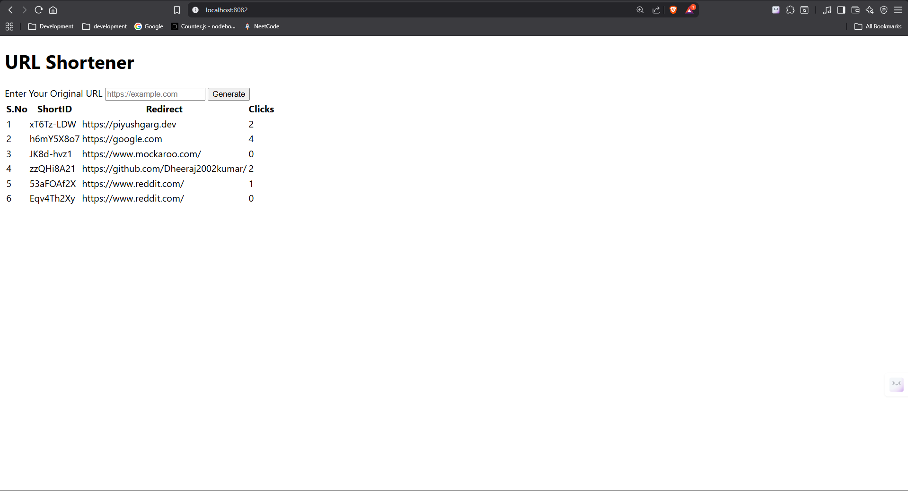
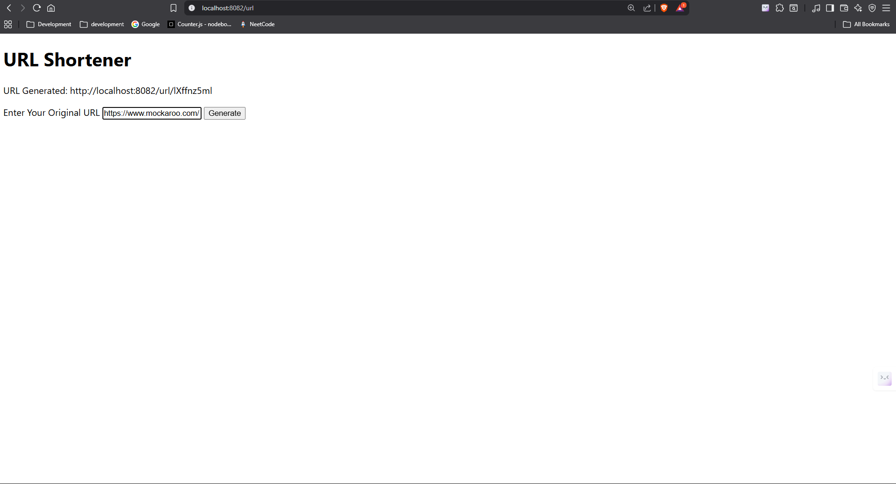

Here’s a cleaner and more structured version of your `README.md`:

---

# URL Shortener Service

This project provides a URL shortener service similar to Bitly. It allows users to generate shortened URLs, redirects them to the original URLs, and tracks the number of visits (clicks) on each shortened URL.

### Example: [Bitly URL Shortener](https://bitly.com/)

## Features

* **Generate Short URL**: Accepts a valid URL and returns a shortened version of it.
* **Redirection**: Redirects users from the shortened URL to the original URL.
* **Click Tracking**: Tracks and returns the total number of visits to the shortened URL.

## Prerequisites

Make sure you have the following installed:

* **Node.js**: [Install Node.js](https://nodejs.org/)
* **MongoDB**: [Install MongoDB](https://www.mongodb.com/try/download/community)

## Dependencies

To run this application, install the required dependencies:

```bash
npm install nanoid express mongoose ejs
```

## API Endpoints

### 1. **POST /url**

Generates a new shortened URL from a valid URL.

#### Request

* **URL**: `POST /url/`
* **Body (JSON format)**:

  ```json
  {
    "url": "https://www.mockaroo.com/"
  }
  ```

#### Response

* **Success (200 OK)**:

  ```json
  {
    "shortened_url": "example.com/random-id"
  }
  ```

* **Error (400 Bad Request)**: If the provided URL is invalid.

  ```json
  {
    "error": "Invalid URL"
  }
  ```

#### Example using Postman:

1. **POST Request**:

   * **URL**: `http://localhost:8082/url/`
   * **Method**: `POST`
   * **Body**: Choose `raw` and `JSON` as the format, then add the following JSON:

     ```json
     {
       "url": "https://www.mockaroo.com/"
     }
     ```

2. **Response**:
   A successful response will return a shortened URL:

   ```json
   {
     "shortened_url": "example.com/random-id"
   }
   ```

---

### 2. **GET /:id**

Redirects the user to the original URL corresponding to the provided shortened URL ID.

#### Request

* **URL**: `GET /:id`
* **Example**: `http://localhost:8082/h6mY5X8o7`
* This request redirects to the original URL.

---

### 3. **GET /url/analytics/:id**

Returns the number of clicks (visits) for the provided short URL ID.

#### Request

* **URL**: `GET /url/analytics/:id`
* **Example**: `http://localhost:8082/url/analytics/h6mY5X8o7`

#### Response

* **Success (200 OK)**:

  ```json
  {
    "clicks": 15
  }
  ```

---

## Example Flow

1. **Generate a Short URL**:

   * POST a valid URL to `localhost:8082/url/` and get the shortened URL.

   

2. **Redirect via Short URL**:

   * Use the returned shortened URL to be redirected to the original URL.

   

3. **View Analytics**:

   * GET the number of clicks for the shortened URL at `localhost:8082/url/analytics/<short-id>`.

---

## Testing the API

You can use **Postman** to test the API. Follow these steps:

1. **Create a POST Request** to generate a short URL.
2. **Use the Short URL** to make a GET request and verify redirection.
3. **Check the Analytics** for the shortened URL with a GET request to view the click count.

---

## Technologies Used

* **Node.js**: JavaScript runtime for building the server.
* **Express.js**: Web framework for handling HTTP requests.
* **MongoDB**: NoSQL database to store URLs and click data.
* **Nanoid**: A library to generate short, unique IDs.
* **EJS**: Template engine (optional for front-end display).

---

## Installation

1. Clone this repository:

   ```bash
   git clone <repo-url>
   ```
2. Navigate to the project directory:

   ```bash
   cd <project-directory>
   ```
3. Install the dependencies:

   ```bash
   npm install
   ```
4. Start the server:

   ```bash
   node index.js
   ```
5. Use **Postman** to test the API.

---

## Future Enhancements

* Implement **User Authentication** for personalized services.
* Add a **Dashboard** to view detailed analytics for each URL.
* Allow **Custom Short URLs** (e.g., `example.com/mycustomurl`).

---
